# A Comparative Study of Fine-tuning Wav2Vec2, ResNet-52, MobileNetV3 and Custom AlexNet Models for Speech Emotion Recognition Tasks On Voice Data 

## 1. Project Overview

This repository presents a **Comparative study** of four deep learning architectures for **Speech Emotion Recognition (SER)** by a PyTorch based apporach:

- **Wav2Vec2** (By Meta)
- **ResNet-512**
- **MobileNetV3 Large**
- **Custom ResNet-type architecture** (designed by me)
#Pipeline Structure
Down here I'm mentioning the pipeline for all that models except **Wav2Vec2**....because Wav2Vec2 taken only the **raw audio** form from **'.wav'** file, so the Mel-Spectrogram conversation is not necessary for this architecture.For the other models this diagram is applicable.

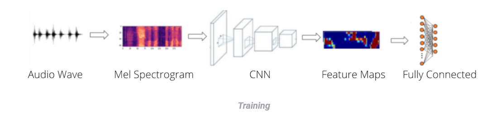

All models were trained and evaluated under these conditions (same dataset split, same preprocessing pipeline, and same evaluation metrics) to ensure a fair comparison.

---

## 2. Comparative Study

The goal of this study is to analyze how different architectural families perform on the speech emotion recognition task:

| Model              | Type                        | 
|--------------------|-----------------------------|
| Wav2Vec2           | Self-supervised Transformer | 
| ResNet-52          | Residual CNN                | 
| MobileNetV3        | Efficient CNN               |
| Custom ResNet-152      | Custom Residual Network |

Each model was trained in **two phases**:

- **Phase 1**: Initial training
- **Phase 2**: Further fine-tuning / continued training

---

## 3. Dataset

- **Dataset used**: RAVDESS Emotional speech audio(Got this from the kaggle here is the link https://www.kaggle.com/datasets/uwrfkaggler/ravdess-emotional-speech-audio
- **Emotions**: In this dataset we have total 8 types of emotion classes(01 = neutral, 02 = calm, 03 = happy, 04 = sad, 05 = angry, 06 = fearful, 07 = disgust, 08 = surprised) 
- **Total samples**: Total 1440 samples are present in t his dataset 
- **Train / Validation / Test split**: 70:15:15 ratio
- **Sampling rate**: 16 kHz
- **Input**: 1.Raw waveform is given for Wav2Vec2 model becasue its not trained on mel-spectogram heat map images

  2. Mel-spectrogram heatmap image data is given for CNNs

---

## 4. Results Table

### Phase 1 Results

| Model          | Train Accuracy | Val Accuracy | F1-Score | Train Loss | Val Loss |
|----------------|----------------|--------------|----------|------------|----------|
| Wav2Vec2       | ~74%           | ~60%         | ~0.572   | ~0.784     | ~1.196   |
| ResNet-152     | ~56%           | ~27%         | ~0.267   | ~1.35      | ~2.64    |
| MobileNetV3    | ~68%           | ~30%         | ~0.300   | ~1.0       | ~1.83    |
| Custom ResNet  | ~94%           | ~57%         | ~0.530   | ~0.4       | ~1.4     |

### Phase 2 Results

| Model          | Train Accuracy | Val Accuracy | F1-Score | Train Loss | Val Loss |
|----------------|----------------|--------------|----------|------------|----------|
| Wav2Vec2       | ~95%           | ~83%         | ~0.826   | ~0.278     | ~0.464   |
| ResNet-152     | ~93%           | ~30%         | ~0.293   | ~0.565     | ~2.125   |
| MobileNetV3    | ~91%           | ~45%         | ~0.41    | ~0.6       | ~1.6     |
| Custom ResNet  | ~96%           | ~59%         | ~0.561   | ~1.5       | ~1.3     |
### Test Set Results   

| Model              | Accuracy | Precision | Recall |
|--------------------|----------|-----------|--------|
| Wav2Vec2           | ~83%     | 0.8480    | 0.8289 |
| ResNet-152         | ~30%     | 0.3488    | 0.2938 |
| MobileNetV3        | ~41%     | 0.41008   | 0.4562 |
| Custom AlexNet     | ~60%     | 0.5969    | 0.6367 | 

---

## 5. Model Architectures & Training Curves

### 5.1 Wav2Vec2

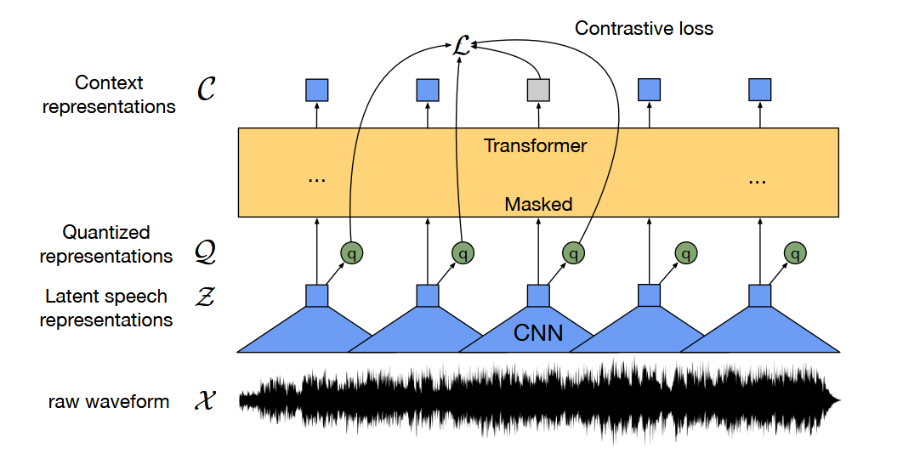

<table>
  <tr>
    <th colspan="2">Phase 1 - Loss & Accuracy</th>
  </tr>
  <tr>
    <td>
      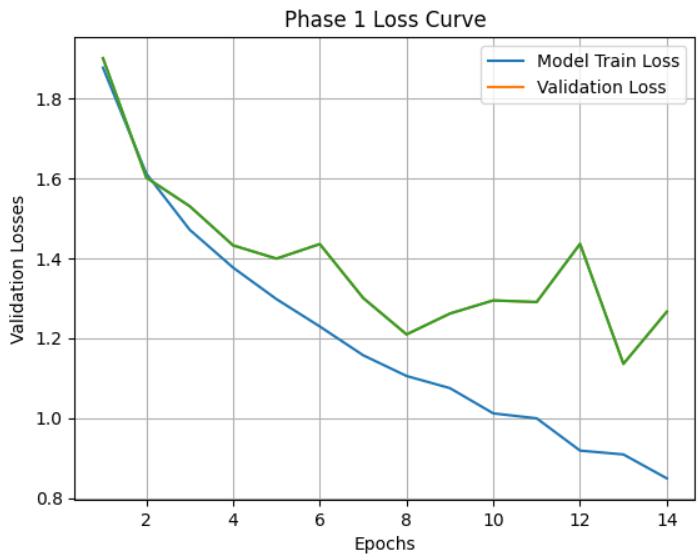
    </td>
    <td>
      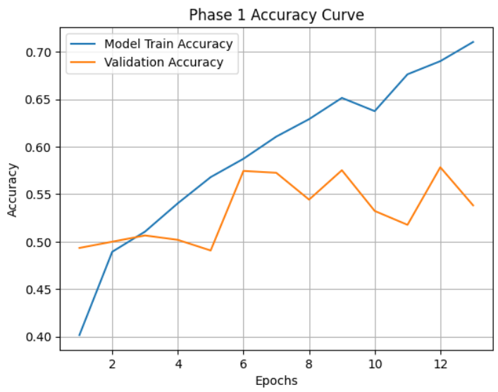
    </td>
  </tr>

  <tr>
    <th colspan="2">Phase 2 - Loss & Accuracy</th>
  </tr>
  <tr>
    <td>
      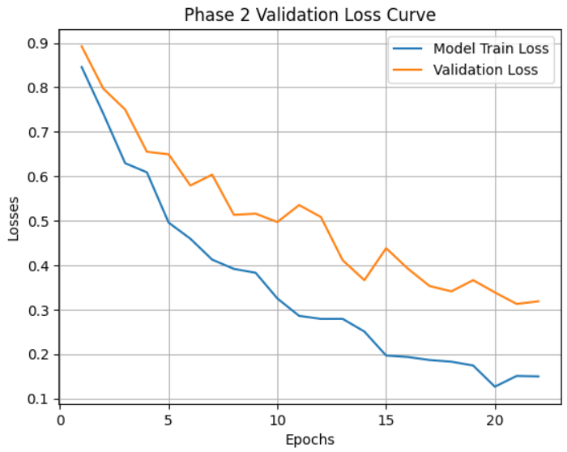
    </td>
    <td>
      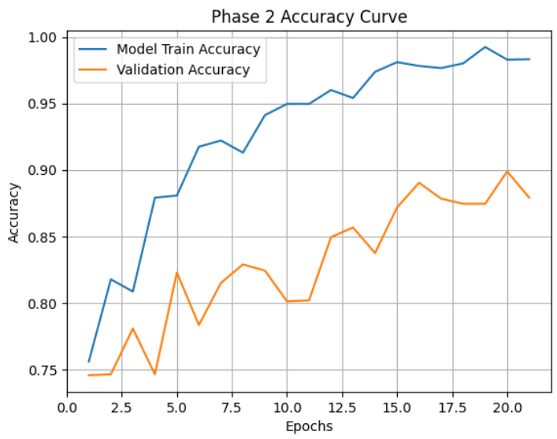
    </td>
  </tr>
</table>

---

### 5.2 ResNet-152
Giving a Basic ResNet block ehich is multiplied and stacked one on another to form ResNet152 Architecture
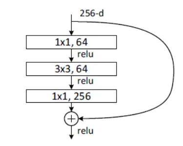

<table>
  <tr>
    <th colspan="2">Phase 1 - Loss & Accuracy</th>
  </tr>
  <tr>
    <td>
      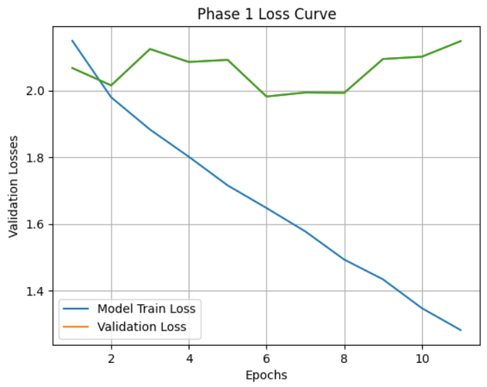
    </td>
    <td>
      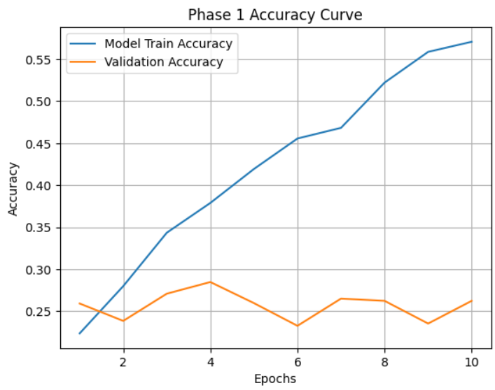
    </td>
  </tr>

  <tr>
    <th colspan="2">Phase 2 - Loss & Accuracy</th>
  </tr>
  <tr>
    <td>
      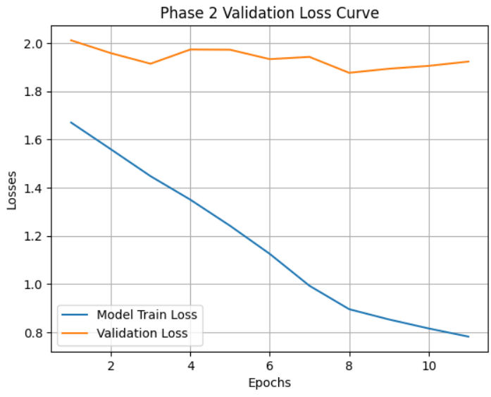
    </td>
    <td>
      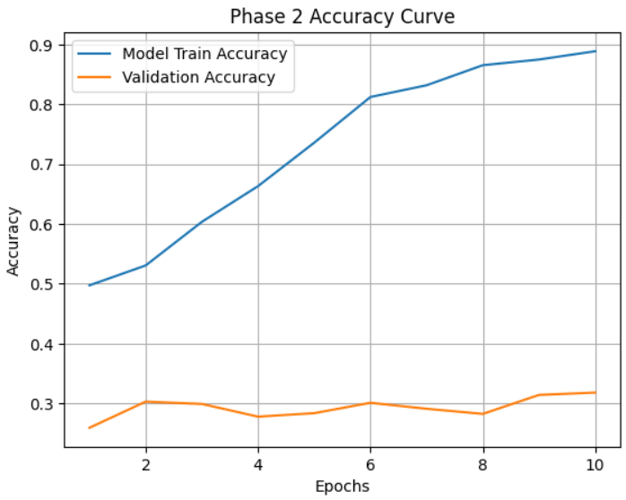
    </td>
  </tr>
</table>
---

### 5.3 MobileNetV3

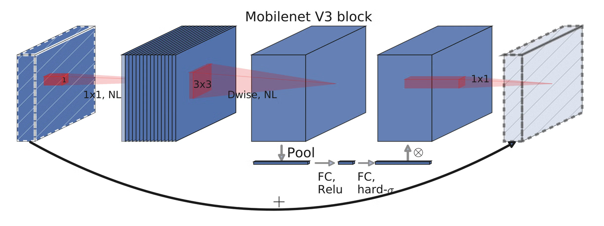

<table>
  <tr>
    <th colspan="2">Phase 1 - Loss & Accuracy</th>
  </tr>
  <tr>
    <td>
      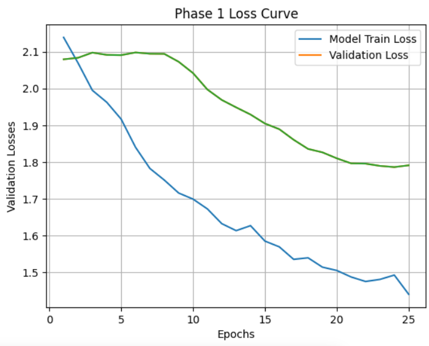
    </td>
    <td>
      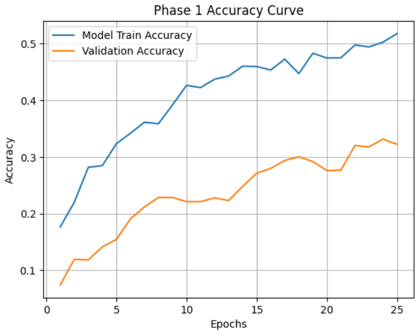
    </td>
  </tr>

  <tr>
    <th colspan="2">Phase 2 - Loss & Accuracy</th>
  </tr>
  <tr>
    <td>
      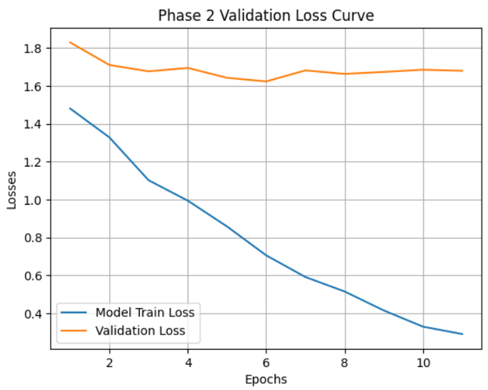
    </td>
    <td>
      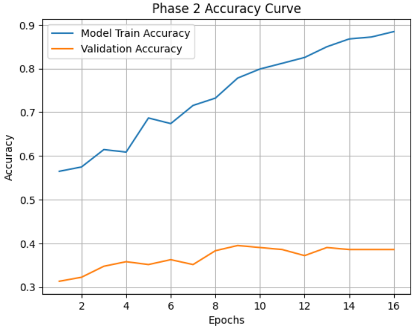
    </td>
  </tr>
</table>
---

### 5.4 Custom AlexNet-type Architecture

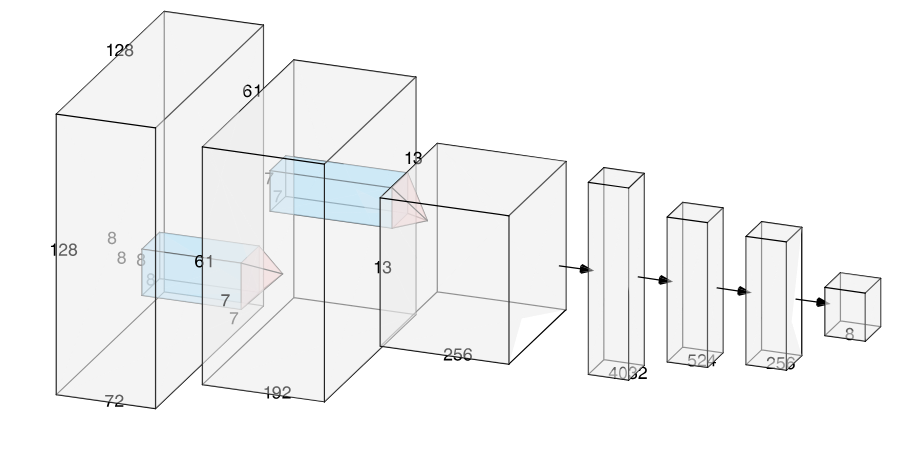

<table>
  <tr>
    <th colspan="2">Phase 1 - Loss & Accuracy</th>
  </tr>
  <tr>
    <td>
      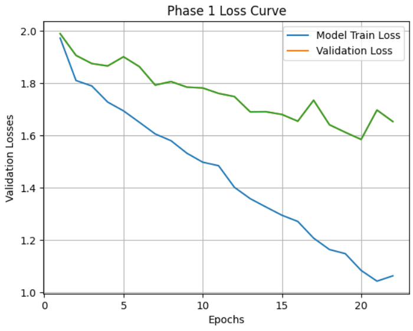
    </td>
    <td>
      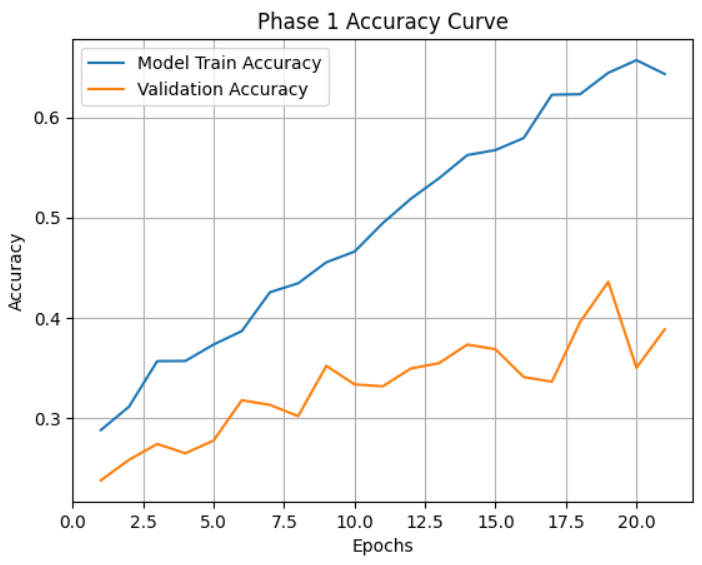
    </td>
  </tr>

  <tr>
    <th colspan="2">Phase 2 - Loss & Accuracy</th>
  </tr>
  <tr>
    <td>
      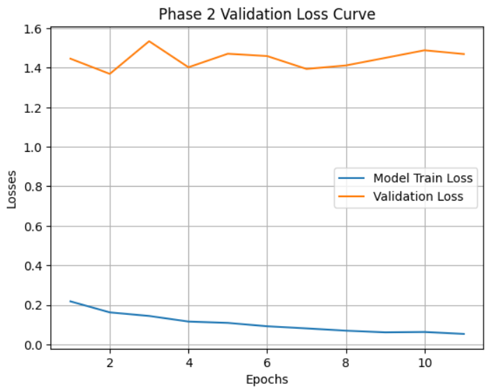
    </td>
    <td>
      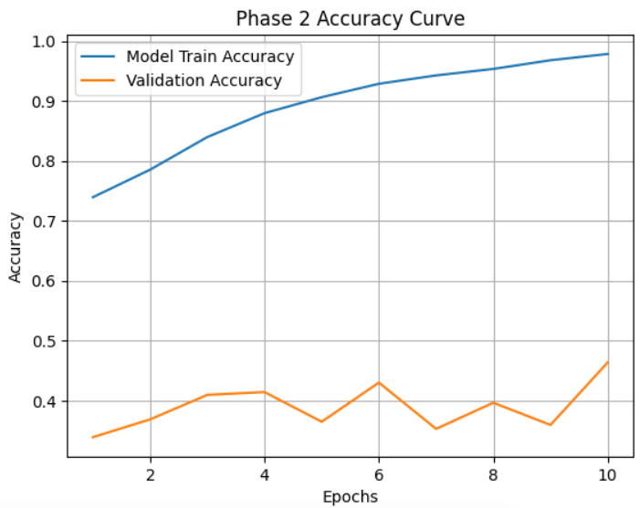
    </td>
  </tr>
</table>

---

